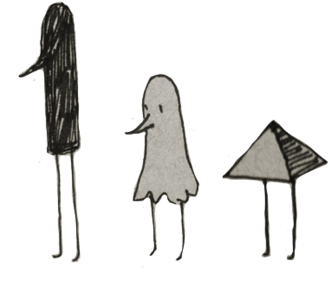

 <b> <samp> petal-stack </samp></b>

  

    &nbsp;&nbsp;&nbsp;<samp><a href="https://github.com/phoenixframework/phoenix">Phoenix</a> </samp>
    &nbsp;&nbsp;&nbsp;<samp><a href="https://github.com/elixir-lang/elixir">Elixir</a></samp>
    &nbsp;&nbsp;&nbsp;<samp><a href="https://github.com/tailwindlabs/tailwindcss">Tailwind</a></samp>
    &nbsp;&nbsp;&nbsp;<samp><a href="https://github.com/alpinejs/alpine/">Alpine</a></samp>
    &nbsp;&nbsp;&nbsp;<samp><a href="https://github.com/phoenixframework/phoenix_live_view">Liveview</a></samp>

  

# Hello I'm Mo! 

Currently studying computer science at HAW Landshut.

 
